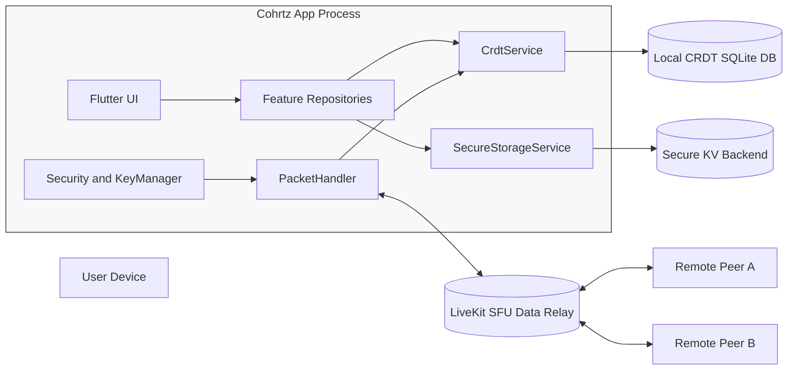

# Architecture Overview

## Summary

Cohrtz is a local-first, peer-synced Flutter app.
State is persisted locally via CRDT-backed SQLite and synchronized over LiveKit data channels.
Security is layered: packet signing, encrypted transport, encrypted payloads, and encrypted local key/value storage.

## Major Runtime Components

- UI and state orchestration
  - Flutter + Riverpod providers (`lib/app/di/`)
  - Vertical slices in `lib/slices/*`
- Local data plane
  - `CrdtService` (native/web variant)
  - `sql_crdt` + Drift integration (`CrdtQueryExecutor`)
  - Feature repositories mapping tables to typed models
- Sync and networking plane
  - `ConnectionManager` (LiveKit room/session lifecycle)
  - `PacketHandler` (verify/decrypt/dispatch)
  - `DataBroadcaster` (encrypt/sign/send with buffering/fallback)
  - `SyncProtocol` (SYNC_REQ election + DATA_CHUNK merge)
- Security plane
  - `SecurityService` (Ed25519 signing, X25519 key exchange)
  - `KeyManager` (group key and vault key lifecycle)
  - `TreeKemHandler` (group key evolution)
  - `SecureStorageService` (encrypted envelope on secure backend)

## Trust Boundaries

## Data and Control Planes

- Data plane
  - CRDT mutations and state convergence across peers
  - Packet types: sync requests, claims, data chunks, consistency checks
- Control plane
  - Token fetch (`/token`) and room connect orchestration
  - Invite acceptance and room transition flow

## Platform Differences

- Native (mobile/desktop)
  - Uses encrypted SQLite CRDT files per logical room DB name
  - Uses native secure blob backend for secure key/value storage
- Web
  - Uses in-memory CRDT room state (`crdt_service_web.dart`)
  - Uses SharedPreferences-backed secure KV backend with encrypted envelope
  - Practical implication: persistence and restart semantics differ from native

## Architectural Constraints

- No explicit wire protocol version field in `P2PPacket`; compatibility is behavior-based.
- Widget rendering is currently hardcoded by widget `type` switch, not plugin-registry-driven.
- Drift schema version is fixed at `1`; runtime table creation and migrations are mostly managed in `CrdtService` and feature repositories.

## Related Docs

- [Data Flow](./data-flow.md)
- [Sync Protocol](./sync-protocol.md)
- [Security Model](./security-model.md)
- [Versioning and Compatibility](./versioning-compatibility.md)
