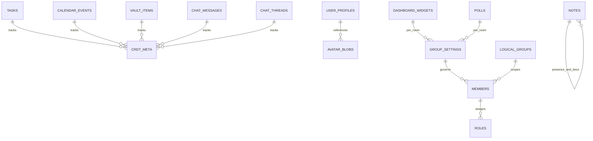

# CRDT Schema Reference

## Summary

Cohrtz stores feature state in per-room CRDT tables with a consistent shape:
- `id` (text primary key)
- `value` (JSON string, except blobs table)
- `is_deleted` (soft-delete marker in Drift schema)

`sql_crdt` metadata columns (for example `hlc`, `node_id`) are used by sync logic and diagnostics.

## Canonical Table Catalog

| Table | ID Convention | Value Format | Notes |
|---|---|---|---|
| `tasks` | `task:*` or UUID-like | `TaskItem` JSON | synced list items |
| `calendar_events` | `event:*` | `CalendarEvent` JSON | shared scheduling |
| `vault_items` | `vault:*` | `VaultItem` JSON | encrypted payload fields at model level |
| `chat_messages` | `msg:*` | `ChatMessage` JSON | thread-linked messages |
| `chat_threads` | thread id | `ChatThread` JSON | includes general + DM/channel metadata |
| `user_profiles` | user id (`user:*`) | `UserProfile` JSON | avatar may be blob-ref-backed |
| `avatar_blobs` | avatar hash/ref | base64 image blob string | table name `avatar_blob_cache` in Drift |
| `members` | member id | `GroupMember` JSON | permission membership source |
| `roles` | role id | `Role` JSON | permission role source |
| `group_settings` | **must be `group_settings`** | `GroupSettings` JSON | canonical singleton row per room |
| `dashboard_widgets` | widget id | `DashboardWidget` JSON | synced layout artifacts |
| `logical_groups` | logical group id | `LogicalGroup` JSON | ACL audience grouping |
| `notes` | `doc:<encoded>` or `presence:<encoded>` | `Note` or `NoteEditorPresence` JSON | document and live presence share table |
| `polls` | `poll:*` | `PollItem` JSON | polling state |
| `cohrtz` | misc internal key | string/json | legacy/general internal table |
| `groupman` | legacy prefixed keys | string/json | migration source table |

## Schema Map

## Initialization Behavior

At room initialization, native `CrdtService` ensures required tables exist via `CREATE TABLE IF NOT EXISTS` for all domain tables.

Important:
- Drift `AppDatabase.schemaVersion` is currently `1`.
- Runtime initialization currently relies on explicit table creation in `CrdtService`, not a full Drift migration chain.

## Deletion Semantics

- Feature deletes should call `CrdtService.delete(room,id,table)`.
- Native delete path does:
  1. `UPDATE table SET value = '' WHERE id = ?`
  2. `DELETE FROM table WHERE id = ?`
- This preserves CRDT tombstone behavior while reducing retained payload bytes.

## Legacy and Repair Paths

### `groupman` migration

On startup, records in `groupman` are mapped by id prefix into typed tables (`tasks`, `calendar_events`, `vault_items`, `chat_messages`, `user_profiles`, `group_settings`, `dashboard_widgets`, `logical_groups`, `notes`, `polls`).

### Group settings canonicalization

Repository logic merges legacy `group_settings` rows into canonical id `group_settings` and removes legacy rows.

### Legacy unique-key repair

`EncryptedSqliteCrdt` can repair legacy tables lacking primary/unique id by:
- de-duplicating by newest row (`hlc`/`rowid` ordering)
- creating `UNIQUE INDEX ... ON table(id)`

## Normative Schema Rules

- New sync-visible feature data MUST use explicit table names and typed JSON mapping.
- Every sync-visible table MUST define deterministic id semantics.
- Deletion MUST use CRDT delete semantics, not local hard-delete-only paths.
- Schema changes MUST update:
  - this table catalog
  - compatibility matrix
  - migration playbook and tests

## Related Docs

- [Data Flow](./data-flow.md)
- [Versioning and Compatibility](./versioning-compatibility.md)
- [Migrations Playbook](./migrations-playbook.md)
