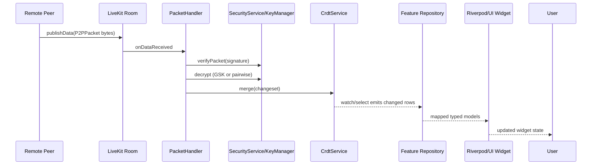
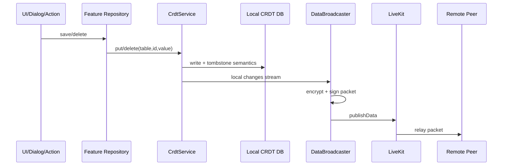

# Data Flow

## End-to-End Inbound Flow

## Local Mutation Outbound Flow

## Receive -> Store -> UI by Domain

| Domain | Table(s) | Producer Path | Consumer Path |
|---|---|---|---|
| Tasks | `tasks` | `TaskRepository.saveTask` | `watchTasks` -> tasks UI widgets |
| Calendar | `calendar_events` | `CalendarRepository.saveEvent` | `watchEvents` -> calendar widgets/pages |
| Vault metadata | `vault_items` | `VaultRepository.saveVaultItem` | `watchVaultItems` -> vault widget |
| Notes docs + presence | `notes` | `NoteRepository.saveNote` / `touchPresence` | `watchNotes`, `watchDocument`, `watchActiveEditors` |
| Chat threads/messages | `chat_threads`, `chat_messages` | `ChatRepository.saveChatThread/saveMessage` | thread/message stream providers and chat widgets |
| Members and roles | `members`, `roles`, `logical_groups` | permission feature repositories | permission providers + members UI |
| Group settings | `group_settings` | `DashboardRepository.saveGroupSettings` | `groupSettingsProvider`, connection metadata watcher |
| User profiles | `user_profiles`, `avatar_blobs` | profile save + avatar blob normalization | profile providers, avatars, membership UI |
| Polls | `polls` | `DashboardRepository.savePoll` | poll stream provider and poll widgets |
| Dashboard layout (sync) | `dashboard_widgets` | `DashboardRepository.saveWidget` | dashboard widget streams |
| Dashboard layout (local-only) | SharedPreferences keys `dashboard_layout_*` | `LocalDashboardStorage.saveWidgets` | dashboard layout loader |

## Storage Semantics

- Most tables store JSON in `value` keyed by logical `id`.
- Deletion uses CRDT tombstones via `CrdtService.delete`.
- Native delete flow scrubs `value` then performs `DELETE` to preserve tombstone behavior while reducing retained payload.
- Canonical `group_settings` record id is `group_settings`; legacy duplicate rows are merged and cleaned.

## Sync Path Specifics

- Incoming `SYNC_REQ`
  - election/backoff determines a single responder
  - responder sends delta from vector clock
- Incoming `DATA_CHUNK`
  - parsed JSON changeset -> HLC parse compatibility -> merge
  - RBAC checks gate role/member/logical group changes outside bootstrap state
- Consistency checks
  - hash/count diagnostics can be exchanged for drift detection

## Failure and Recovery in Flow

- Unknown sender key: packet buffered until handshake key material arrives.
- Missing or stale GSK: packet can be buffered and replayed after key update.
- Broadcast encryption failure: fallback to pairwise secure unicast.
- Database corruption (`SqliteException` code 26): native DB file is recreated.

## Related Docs

- [CRDT Schema Reference](./crdt-schema-reference.md)
- [Sync Protocol](./sync-protocol.md)
- [Security Model](./security-model.md)
- [Operations Runbooks](./operations-runbooks.md)
