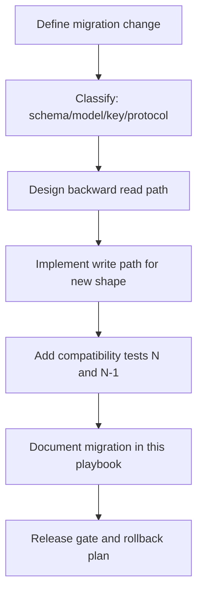

# Migrations Playbook

## Summary

This playbook defines how Cohrtz evolves data, schema, and protocol behavior without breaking N/N-1 compatibility.

## Migration Types

1. CRDT table and key-shape migrations
2. Model JSON compatibility migrations
3. Secure storage key migrations
4. Protocol semantic migrations

## Existing Migration Paths in Code

- Legacy plaintext -> secure storage migration
  - global/group profile keys
  - known group metadata and token storage
- Legacy `groupman` table -> typed table migration
- Legacy duplicate `group_settings` row merge into canonical id
- Legacy id-constraint repair with unique index creation in CRDT DB helper
- Vault key initialization marker backfill for older installs

## Migration Flow

## Mandatory Steps for New Migration

1. Design
- Define source shape and target shape.
- Specify idempotent behavior (safe to re-run).
- Specify fallback for partially migrated state.

2. Implementation
- Prefer read-repair or startup migration patterns.
- Avoid destructive rewrite unless backups/recovery are defined.
- Keep old readers operational during the N/N-1 window.

3. Validation
- Add unit tests for legacy payload parsing.
- Add integration tests for cross-version mutation and merge behavior.
- Verify no data loss with repeated startup and reconnect cycles.

4. Documentation
- Update:
  - `crdt-schema-reference.md`
  - `versioning-compatibility.md`
  - `testing-and-validation.md`
  - this file

## Schema Evolution Rules

- If adding a new sync table:
  - add table creation in CRDT init paths
  - add repository read/write path
  - add merge/read validation tests
- If changing id convention:
  - include mapping logic from old ids to new ids
  - keep dual-read window during migration period

## Secure Storage Evolution Rules

- Never silently discard unreadable secure values.
- Envelope version changes MUST support old decode path during N/N-1.
- Key namespace migrations MUST include old-key lookup and cleanup logic.

## Protocol Evolution Rules

- Changes to packet meaning without new type must include compatibility guard logic.
- New control message subtypes in `UNICAST_REQ` payload must be ignorable by older clients.

## Rollback Strategy

For every migration change, define:
- rollback trigger conditions
- data safety expectation if rollback occurs after partial migration
- explicit operator/developer steps for restoring operability

## Pre-Release Migration Checklist

- [ ] Migration idempotent on repeated launches
- [ ] N/N-1 compatibility test pass
- [ ] Legacy fixtures parse with expected defaults
- [ ] No destructive fallback on missing/decrypt-failed keys
- [ ] Recovery path documented in operations runbook

## Related Docs

- [CRDT Schema Reference](./crdt-schema-reference.md)
- [Versioning and Compatibility](./versioning-compatibility.md)
- [Operations Runbooks](./operations-runbooks.md)
