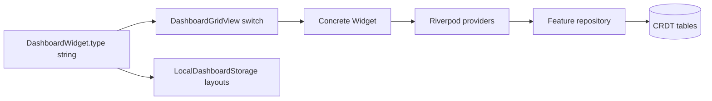
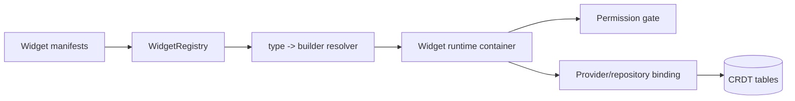

# Widget Modding (FOSS Extensibility)

## Summary

Current widget extensibility is code-driven and hardcoded.
This document captures the present architecture and a normative roadmap to a pluggable registry model.

## Current State

Widget support is currently coupled across multiple locations.

### Hardcoded integration points

- Type catalog: `DashboardWidget.allTypes`
- Render mapping: `DashboardGridView` switch on `widget.type`
- Permissions and feature wiring: providers and feature-specific permission checks
- Local layout defaults and persistence: `dashboardWidgetsProvider` + `LocalDashboardStorage`

### Current extension cost

Adding a new widget today typically requires edits in:
- model type list
- dashboard rendering switch
- permissions model and checks
- repository/providers for data source
- default layout injection logic

## Current Architecture Diagram



## Target Roadmap: Registry-Based Modding

## Proposed contracts (documentation-level target)

```dart
abstract class WidgetManifest {
  String get id;
  String get type;
  int get schemaVersion;
  Set<String> get requiredCapabilities;
  Set<int> get requiredPermissions;
}

abstract class WidgetRegistry {
  void register(WidgetManifest manifest, WidgetBuilderFactory factory);
  bool supportsType(String type);
  Widget build(String type, WidgetContext context);
}
```

## Target Architecture Diagram



## Normative Modding Rules

- Widget type identifiers MUST be globally unique and stable.
- Widget data schema MUST be versioned and backward-readable for N/N-1.
- Widget manifests MUST declare required permissions and capabilities.
- Unrecognized widget types MUST fail safely (render placeholder, do not crash).
- New widget modules MUST provide migration notes when changing persisted payload shape.

## Backward Compatibility for Widgets

- Existing hardcoded widget types remain first-class and mapped through a default registry adapter.
- Layout records containing unknown widget types should remain persisted and recoverable after plugin/module install.

## Suggested Implementation Phases

1. Introduce registry abstraction while retaining current switch as fallback.
2. Move built-in widgets into manifest+factory registration.
3. Add capability/permission declaration validation.
4. Add plugin packaging and discovery conventions.
5. Deprecate direct switch-based rendering after parity.

## Related Docs

- [Architecture Overview](./architecture-overview.md)
- [Versioning and Compatibility](./versioning-compatibility.md)
- [Migrations Playbook](./migrations-playbook.md)
