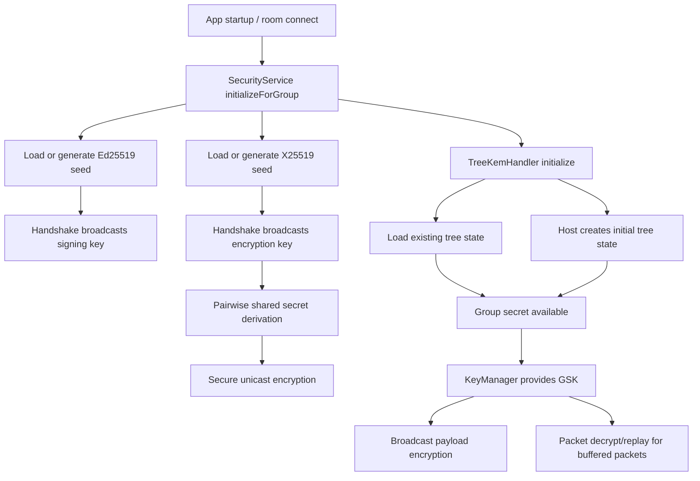
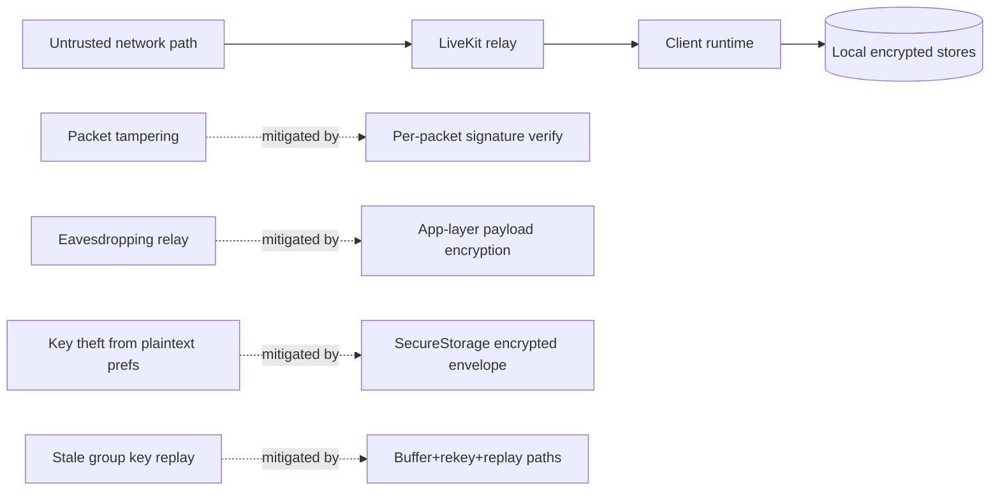

# Security Model

## Security Objectives

- Authenticate packet authorship and detect tampering.
- Encrypt sync payloads end-to-end at application layer.
- Protect sensitive local data and key material at rest.
- Support forward-evolving group key state (TreeKEM) with recoverable fallbacks.

## Primitive Inventory

| Purpose | Primitive/Mechanism | Code Path |
|---|---|---|
| Packet signing | Ed25519 | `SecurityService.signPacket/verifyPacket` |
| Pairwise key exchange | X25519 + HKDF | `SecurityService.deriveSharedSecret` |
| Payload encryption | AES-GCM-256 | `EncryptionService.encrypt/decrypt` |
| Secure store envelope | AES-GCM + envelope version byte | `SecureStorageService` + `EncryptedEnvelopeCodec` |
| Master key derivation | Argon2id | `DeviceDerivedMasterKeyProvider` |
| Group key evolution | TreeKEM-like ratchet | `TreeKemHandler` + `TreekemService` |

## Key Lifecycle

## Packet Security Pipeline

1. Parse packet.
2. Resolve sender public key (or wait for handshake material).
3. Verify signature over deterministic field set.
4. Decrypt payload (group key, pairwise fallback).
5. Only then dispatch and apply side effects.

Unsigned or invalid packets are dropped.

## Local Data-at-Rest

- Native CRDT database uses SQLCipher key via `PRAGMA key` when opening CRDT DB.
- Device DB key is generated and stored in secure storage under `device_db_key`.
- Secure storage values are envelope-encrypted before backend write.
- Native secure backend stores encrypted blobs in local SQLite table `secure_blobs`.
- Web backend stores encrypted blobs in SharedPreferences keyspace with `secure_blob_` prefix.

## Trust Boundaries and Threat Model

## Security-Relevant Constraints and Risks

- `P2PPacket` has no explicit protocol version field; compatibility errors can become parse/semantic issues.
- Signature payload currently focuses on selected fields; additions must preserve deterministic verification behavior.
- Web secure storage uses browser-local preferences backend and differs from native secure enclave/keychain semantics.
- TreeKEM implementation is custom and must be treated as implementation-sensitive; interoperability and security audits should track this separately.

## Incident Response Baseline

1. Identify scope
- affected room(s), packet type(s), key state symptoms.
2. Contain
- disconnect room(s), clear in-memory group key if needed, force handshake/rekey.
3. Recover
- re-establish handshake, replay buffered packets, verify consistency hash.
4. Post-incident
- capture logs, packet ids, and add regression tests for observed failure mode.

## Normative Security Rules

- All mutating sync packets MUST be verified before merge.
- Security-sensitive migrations MUST include rollback-safe behavior.
- Group key and vault key auto-generation MUST avoid silent data-loss scenarios when prior encrypted data exists.
- Security changes MUST update:
  - this document
  - compatibility matrix
  - security tests

## Related Docs

- [Sync Protocol](./sync-protocol.md)
- [Versioning and Compatibility](./versioning-compatibility.md)
- [Operations Runbooks](./operations-runbooks.md)
- [Testing and Validation](./testing-and-validation.md)
