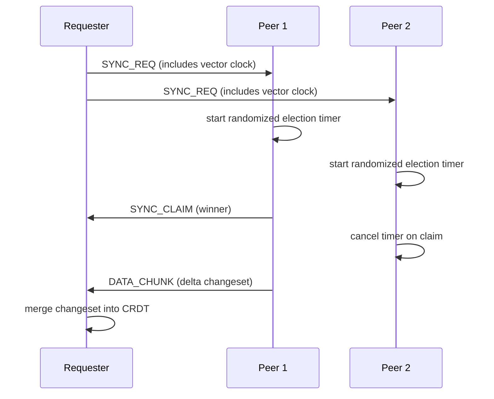
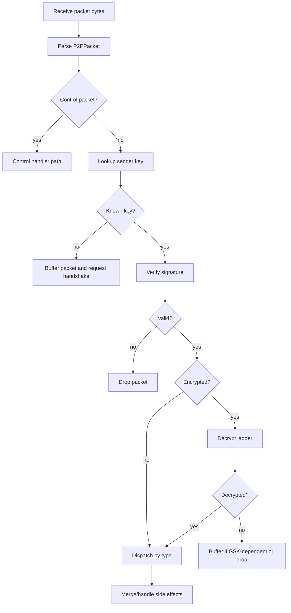

# Sync Protocol

## Summary

Cohrtz sync is a peer protocol over LiveKit data channels using protobuf packets.
Core behavior includes:
- Handshake-based key discovery
- Election-based `SYNC_REQ` response selection
- Vector-clock delta transfer in `DATA_CHUNK`
- Per-packet signature verification and layered decryption

## Packet Types

| Type | Purpose | Typical Routing |
|---|---|---|
| `HANDSHAKE` | exchange signing/encryption pubkeys | broadcast plaintext |
| `SYNC_REQ` | request missing data | broadcast (pairwise fallback if needed) |
| `SYNC_CLAIM` | election winner announcement | broadcast |
| `DATA_CHUNK` | serialized changeset payload | secure unicast (primary) or encrypted broadcast paths |
| `CONSISTENCY_CHECK` | diagnostics hash/count exchange | encrypted broadcast |
| `INVITE_REQ/ACK/NACK` | invite-room join handshake | broadcast plaintext in invite room |
| `UNICAST_REQ/ACK` | control and secure point-to-point messages | targeted path; also overloaded for control payloads |

## Sync Election Flow

## Packet Processing Pipeline

## Decryption Ladder

Order used for encrypted packet processing:
1. If room has direct session key, try session decrypt.
2. Else try group key (`KeyManager.getGroupKey(allowWait:false)`).
3. Else try pairwise derived secret from sender encryption pubkey.
4. If packet type needs group key and decrypt fails, buffer for replay after key update.

## Invite and Room Transition

- Joiner enters invite room and sends `INVITE_REQ` with code.
- Host validates invite code by querying connected data-room `group_settings`.
- Host sends:
  - `INVITE_ACK` with data room name on success
  - `INVITE_NACK` with error message on reject
- Joiner transitions from invite room to data room and continues handshake/sync.

Invite handling is idempotent by `requestId` cache for ACK replay resilience.

## RBAC Guards on Sync Merge

Before applying incoming `DATA_CHUNK` changes:
- Changes touching `roles` or `members` require sender permission `manageRoles` (except bootstrap state).
- Changes touching `logical_groups` require both `manageRoles` and `manageMembers`.
- Unauthorized changes are rejected.

## Diagnostics and Integrity

- Consistency diagnostics compute logical count plus hash/merkle-like digest.
- Packet handler can persist `DATA_CHUNK` records to packet store for legacy/audit visibility.

## Known Protocol Constraints

- No explicit protocol version field in `P2PPacket`.
- Some packet fields exist but are not universally exercised in runtime flows (`uncompressed_size`, chunk metadata).
- `UNICAST_REQ` currently multiplexes several control message subtypes via JSON payload `type`.

## Normative Protocol Rules

- New packet types MUST be safely ignored by older clients or behind compatibility gates.
- New required fields MUST have backward-safe defaults or rollout staging.
- Security-sensitive packets MUST remain signed and verified before side effects.
- Role/member/logical-group mutations MUST continue permission enforcement at merge boundary.

## Related Docs

- [Security Model](./security-model.md)
- [Versioning and Compatibility](./versioning-compatibility.md)
- [Operations Runbooks](./operations-runbooks.md)
