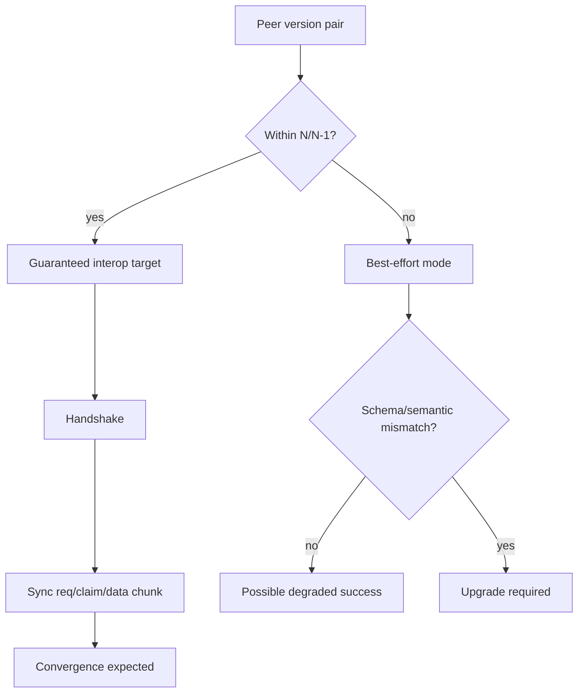

# Versioning and Compatibility

## Policy

Cohrtz enforces a documentation-level interoperability target of **N/N-1**.

- N clients MUST interoperate with N-1 clients.
- N clients MAY degrade with N-2+ clients; no guarantee.
- Room operators SHOULD keep peers within one release window.

## Do All Users Need the Same Version?

No, not strictly.

Under this policy:
- Users do **not** all need the exact same version.
- They do need to remain within the N/N-1 window for guaranteed sync behavior.

## Compatibility Dimensions

| Dimension | Current State | N/N-1 Requirement |
|---|---|---|
| Wire packet schema | Protobuf `P2PPacket`, no explicit protocol version field | Additive changes only; old clients must ignore unknowns safely |
| Packet semantics | Control subtypes multiplexed in payload JSON for `UNICAST_REQ` | New control subtypes require fallback/default handling |
| CRDT table schema | Drift schemaVersion `1`; runtime table creation and legacy repairs | New tables/fields must not break existing table readers |
| Model JSON | mapper-based typed models with legacy defaults in key places | Added fields must be optional with safe defaults |
| Key material/state | group keys + TreeKEM persisted state and fallback logic | Missing key state must recover via request/handshake without destructive reset |
| Platform persistence | native persistent CRDT, web in-memory CRDT service | Documented behavioral difference must remain explicit |

## Compatibility Matrix

## Forward-Compatible Change Rules

### Wire changes

- New protobuf fields MUST be optional and ignorable by older clients.
- New packet types SHOULD include a safe no-op path on older clients.
- Behavior changes hidden behind existing packet types MUST include semantic compatibility checks.

### Data model changes

- JSON model additions MUST have defaults (as in profile/group-settings compatibility tests).
- Renames/removals MUST include temporary dual-read migration windows.

### Table/schema changes

- New table introduction MUST not break startup for older clients.
- Existing table key conventions MUST remain stable or be migrated via documented mapping.
- Canonical singleton ids (for example `group_settings`) MUST remain stable.

## Breaking Change Conditions

A change is considered breaking if any applies:
- Older client cannot parse or safely ignore incoming packet.
- Older client can parse but applies incorrect security-sensitive side effect.
- Data written by newer client is unreadable by older client without fallback.
- Key lifecycle change causes unrecoverable decrypt failures for N-1.

Breaking changes require either:
- staged rollout with compatibility shim, or
- explicit major-version policy update and forced-upgrade flow.

## Release Gate Checklist (Compatibility)

Before release, verify:
- N vs N-1 two-client sync smoke for core tables
- packet verify/decrypt paths still accept previous release packets
- migration routines cover legacy ids/rows and secure-storage key presence
- no silent destructive fallback on missing keys

## Related Docs

- [Migrations Playbook](./migrations-playbook.md)
- [Sync Protocol](./sync-protocol.md)
- [Testing and Validation](./testing-and-validation.md)
